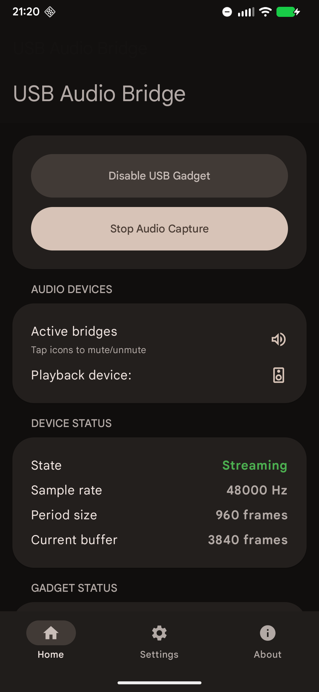
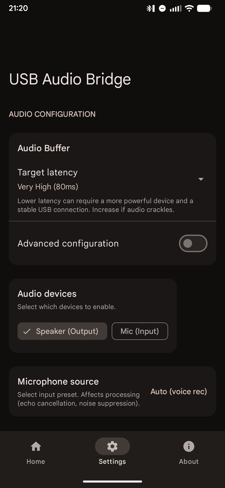
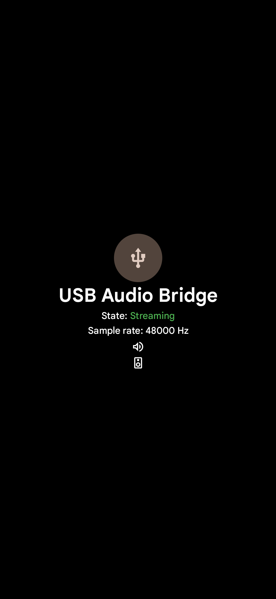
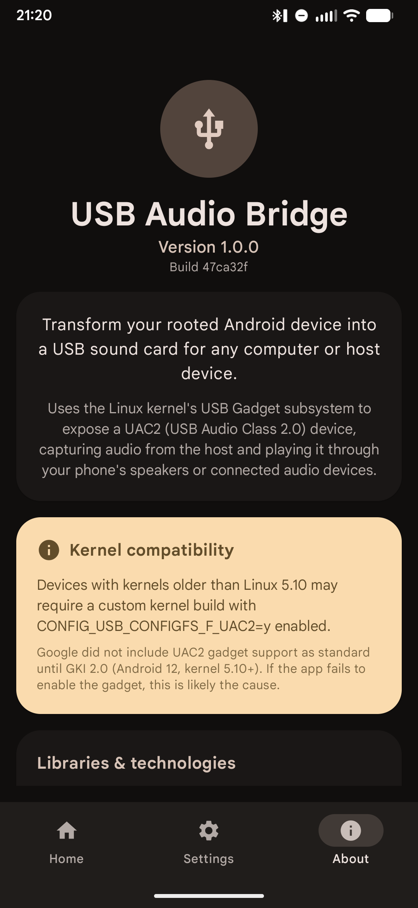

# USB Audio Bridge

[](https://github.com/Flopster101/UsbAudioBridge/actions/workflows/android-build.yml)
[](https://www.gnu.org/licenses/gpl-3.0)

USB Audio Bridge turns a rooted Android device into a USB Audio Class 2.0 sound card for any USB host (PC, phone, tablet). It exposes a UAC2 gadget via ConfigFS, captures audio from the host, and plays it on the phone. It can also send the phone microphone back to the host.

No additional drivers or companion apps are required on the host.

## Requirements
- Rooted Android device using one of the supported root solutions:
	- Magisk
	- KernelSU
	- APatch (untested)
- Kernel with UAC2 gadget support: `CONFIG_USB_CONFIGFS_F_UAC2=y`
	- Standard on GKI 2.0+ (Android 12 / kernel 5.10+)
	- Older kernels may require a custom build

## How it works
- Configures a USB Gadget (UAC2) using ConfigFS.
- Captures audio via TinyALSA from the gadget PCM device.
- Bridges to the selected output engine (AAudio/OpenSL/AudioTrack).
- Provides separate mute controls for speaker and mic at the native layer.

## Features
- UAC2 gadget emulation (plug-and-play on most hosts)
- Speaker and mic bridging at the same time
- Multiple audio engines: AAudio, OpenSL ES, AudioTrack
- Configurable latency presets and advanced buffer controls
- Foreground service with media button support
- Optional ADB preservation via composite gadget mode (may not work on all devices)
- Hardware workarounds for known controller quirks (e.g., some MediaTek UDCs)
- "Keep screen on" feature with optional screensaver
- Mute / unmute with headset media button
- Interactive notification

## Usage
1. Ensure root access is granted and your kernel supports UAC2 gadget mode.
2. Open the app and enable the USB gadget.
3. Connect the device to the host via USB.
4. Start audio capture to begin the bridge.
5. Use the speaker and mic controls to mute/unmute as needed.

## Downloads
Releases are not published yet. For now, CI builds are available here:
- [nightly.link (CI builds)](https://nightly.link/Flopster101/UsbAudioBridge/workflows/android-build/master?preview)

Alternative (raw GitHub Actions artifacts):
- [GitHub Actions](https://github.com/flopster101/UACExperiment/actions)

Note: CI artifacts are debug-only and may be unoptimized.

## Screenshots
<p>
	
	
	
</p>
<p>
	
	
</p>

## Build
```bash
cd UsbAudioMonitor
./gradlew assembleDebug
```
The debug APK will be at `app/build/outputs/apk/debug/app-debug.apk`.

```bash
./gradlew assembleRelease
```
The release APK will be at `app/build/outputs/apk/release/app-release-unsigned.apk`.

## Notes and troubleshooting
- Some devices may have audio crackling under load. Current evidence points to it being caused by a mix of CPU load and USB bus contention. No fix is known.
- On older kernels (roughly < 5.4), Windows may detect the gadget as an "Internal AUX Port" and disable/mute it by default. If there is no audio, open the Windows Sound Control Panel and enable the device.
- If the host does not detect audio, verify that the gadget is enabled and that the correct UDC controller is selected.
- Some vendor USB HALs can interfere with gadget mode; the app attempts to stop conflicting services when needed.
- 192kHz sample rate may not work on all devices. Some platforms (e.g., Samsung Exynos 1280) fail to bind the gadget at this rate while lower rates work fine. This is a likely kernel driver limitation.

## License
GNU GPLv3
